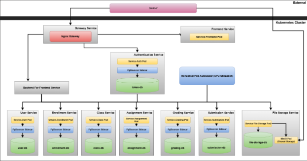
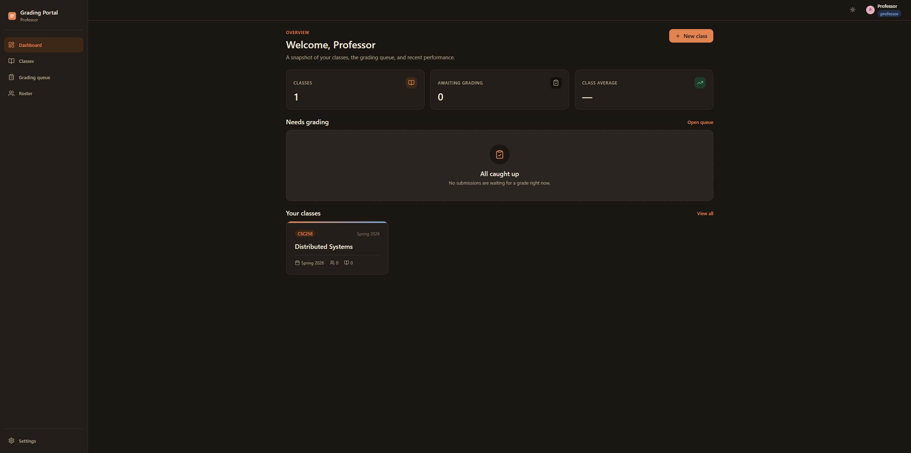
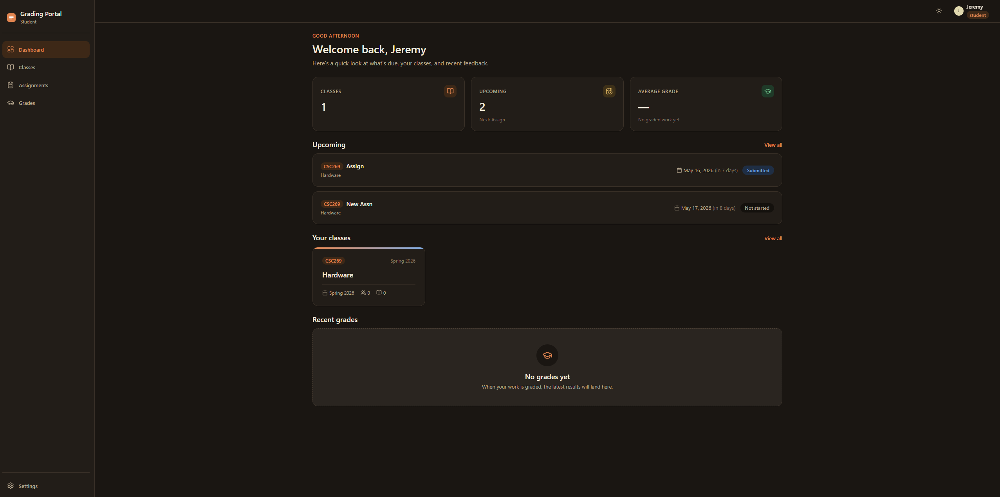

# Grading Portal — CSC258 Final Project

A microservices-based student grading system with Docker Compose (development) and Kubernetes (production) deployment.

---

## For the Professor — What This System Does

This application lets professors and students interact with a simple grading portal.

**Professors** can create classes, add assignments, and set due dates. They can view student rosters and add students by email (no pre-registration required — the system resolves email to an account), grade submitted work, leave feedback, and see submitted files directly in the browser through presigned storage links.

**Students** can register with their name, email, password and role, then sign in to enroll in classes, submit assignments (with file uploads), and view grades and feedback from a dashboard that groups all assignments by class.

Authentication is handled by [`fastapi-users`](https://fastapi-users.github.io/fastapi-users/) with bcrypt-hashed passwords. `service-user` issues short-lived JWT access tokens (15 min) at `/auth/login` and rotating opaque refresh tokens delivered as `HttpOnly; SameSite=Lax` cookies scoped to `/api/auth`. Edge token validation happens in the Nginx gateway via an `auth_request` subrequest to `/auth/verify`, which strips the bearer token and re-injects identity as `X-Auth-User-{Id,Role,Name,Email}` request headers. Backend services trust those gateway-injected headers and never see the JWT, so only `service-user` holds the signing secret. Service-to-service traffic in Compose is protected by mutual TLS — see **Security architecture** below.

Both roles use a single-page React frontend that communicates with a RESTful API. The entire system is self-contained — run it with one command on a single machine, or scale it to many replicas with Kubernetes.

---

## Architecture Highlights

- **Domain-aligned microservices** — each service owns its own PostgreSQL database:
  - `service-auth` — authentication
  - `service-user` — user accounts and search
  - `service-enrollment` — enrollments 
  - `service-class` — classes, rosters
  - `service-assignment` — assignments
  - `service-submission` — file uploads (stored in MinIO)
  - `service-grade-records` — grades and feedback
  - `service-file-storage` — manages databases
  - `service-frontend` — React/TypeScript app served by Nginx
- **Per-service database with persistent storage** via Kubernetes StatefulSets and PVCs
- **Connection pooling** via PgBouncer sidecars to keep database connections optimal when autoscaling
- **Horizontal Pod Autoscaler (HPA)** on every backend service — automatically scales pods based on CPU load (70% target)
- **Presigned file storage** — MinIO generates short-lived URLs so the browser can directly download submitted files
- **Email-resolved roster** — professors add students by email; the user service resolves it to a UUID before enrolling

---

## Architecture Diagram



---

## Application Screenshots

**Professor View**


**Student View**


---

## Quick Start — Docker Compose (Local Development)

### Prerequisites

- Docker and Docker Compose v2
- No extra setup — the Compose file starts all services, databases, and MinIO automatically

### Steps

1. Clone the repository.
2. Create a `.env` file in the project root (see example below).
3. Start everything:

```bash
docker-compose up --build
```

4. Access the frontend at http://localhost:3000.

### Example `.env`

```env
STORAGE_TYPE=minio
MINIO_ENDPOINT=minio:9000
MINIO_ACCESS_KEY=minioadmin
MINIO_SECRET_KEY=minioadmin

# Shared HMAC secret used to sign and verify JWT access tokens.
# Replace with a strong random value before any non-local deployment
# (e.g. `openssl rand -hex 32`).
AUTH_SECRET=dev-only-change-me-please-32bytes-min
JWT_LIFETIME_SECONDS=900
REFRESH_LIFETIME_SECONDS=604800
REFRESH_COOKIE_SECURE=false
```

### Generate development TLS certificates

The Compose stack enforces mTLS between every service. Before the first `docker-compose up`, generate a local CA and per-service certificates:

```powershell
# Windows / PowerShell
./scripts/gen-certs.ps1
```

```bash
# macOS / Linux
./scripts/gen-certs.sh
```

This writes `certs/ca.crt`, `certs/ca.key`, and a `<service>.crt` / `<service>.key` pair for each backend plus the Nginx frontend. The `certs/` directory is mounted read-only into every container at `/etc/svc-certs`. Re-run with `-Force` (PowerShell) or simply re-run the bash script to regenerate.

### First-Run Sign Up

The app starts with an empty user database. From the login page click **Create one** and register a professor account first — then you can register additional student accounts (or have students self-register) and add them to a class by email.

### Useful Commands

| Action | Command |
|---|---|
| Stop all containers | `docker-compose down` |
| Wipe all data (volumes) | `docker-compose down -v` |
| Start only one service | `docker-compose up --build service-assignment postgres-assignments minio` |

### Services and Ports

| Component | URL |
|---|---|
| Frontend / API gateway | http://localhost:3000 |
| MinIO Console | http://localhost:9001 |

Backend services are intentionally **not** exposed on host ports. They listen on HTTPS inside the Compose network and only accept connections that present a client certificate signed by the dev CA. Reach them through the gateway at `http://localhost:3000/api/...`. To poke at a backend directly during debugging, exec into a container that has a mounted client cert:

```bash
docker compose exec service-user curl --cacert /etc/svc-certs/ca.crt \
    --cert /etc/svc-certs/service-user.crt --key /etc/svc-certs/service-user.key \
    https://service-user:8000/health
```

---

## Security architecture

The Compose deployment models a small distributed system with these properties:

1. **Edge token validation in the API gateway.** Nginx terminates client TLS, then for every protected route runs an internal `auth_request` to `service-user` `/auth/verify`. The auth service decodes the bearer JWT and writes `X-Auth-User-{Id,Role,Name,Email}` response headers, which the gateway captures and re-injects as request headers before proxying upstream. Public auth endpoints (`/api/auth/*`) explicitly *strip* any client-supplied `X-Auth-User-*` headers to prevent header smuggling.
2. **Short-lived access tokens + rotating refresh tokens.** Access tokens are 15-minute HS256 JWTs carrying `sub`, `role`, `name`, `email`. Refresh tokens are opaque 256-bit secrets stored SHA-256-hashed in `service-user`'s database, delivered as `HttpOnly; Secure-when-prod; SameSite=Lax` cookies scoped to `/api/auth`, and rotated on every `/auth/refresh`. Logout revokes the row and clears the cookie. The frontend keeps the access token only in a module-scoped JS variable, never `localStorage`.
3. **Local authorization in each service.** Every backend exposes a `require_role(...)` dependency that reads gateway-injected headers and rejects requests whose role doesn't match. The auth headers are the only identity input — no service re-validates JWTs or holds the signing secret.
4. **mTLS service mesh.** Each service has its own certificate signed by the local dev CA and uvicorn is started with `--ssl-cert-reqs 2` (CERT_REQUIRED). Every outbound peer call uses `mtls_client()` (httpx with `verify=ca.crt, cert=(svc.crt, svc.key)`). Nginx presents `frontend.crt` as a client certificate when proxying. A request from outside the Compose network — even with a valid bearer token — fails the TLS handshake before any HTTP code runs (try `curl https://service-user:8000/health` from a container without a cert: exit code 56).
5. **Kubernetes caveat.** The manifests in `kubernetes/` do *not* enable mTLS between pods. In a real cluster this layer would be supplied by a service mesh (Linkerd or Istio sidecars / ambient) rather than baked into application code. The Compose stack is therefore the canonical security demo for the project.

---

## Production-Style Kubernetes Deployment (kind)

We use [kind](https://kind.sigs.k8s.io/) (Kubernetes in Docker) to run a full cluster locally. A single batch file automates everything.

### Prerequisites

- Docker Desktop
- `kind` and `kubectl` (install via Chocolatey or direct download)
- (Optional) `hey` for load testing

### One-Command Deployment

```batch
deploy_kind.bat
```

To access SwaggerUI for each service, run:

```batch
port_forward_backend.bat
```

This script:

1. Checks for `kind`/`kubectl` and creates the kind cluster if missing
2. Installs the Metrics Server (required for HPA)
3. Builds all Docker images
4. Loads them into the kind cluster
5. Applies all Kubernetes manifests (databases, services, MinIO, Ingress, HPAs)
6. Waits for all pods to be ready
7. Asks if you want to port-forward the frontend (and optionally MinIO for file access)

After it finishes, you will have a fully working, autoscaling microservices environment.

### Manual Steps (Optional)

Create a cluster:

```bash
kind create cluster --name csc258-final-project-cluster
```

Then build, load, and deploy as described in the batch file.

Port-forward the frontend:

```bash
kubectl port-forward svc/service-frontend 8080:80
```

### MinIO & File Uploads

File submissions are stored in MinIO. To let the browser download files (e.g. on the grading page), you need to port-forward MinIO as well:

```bash
kubectl port-forward svc/minio 9000:9000
```

The batch script offers to open a separate terminal for this automatically.

### Scaling Demonstration

```bash
pip install locust
python -m locust -f locustfile.py --host=http://localhost:8080
```

Open Locust web UI at http://localhost:8089 and set load testing parameters

Watch the replicas increase:

```bash
kubectl get hpa -w
```

After the load stops, the HPA will scale back down automatically (after 5 minutes).

### Clean-Up

```bash
kind delete cluster --name csc258-final-project-cluster
```

---

## Key Changes Since Initial Version

- **Kubernetes deployment** with persistent databases (PostgreSQL StatefulSets), PgBouncer sidecar pooling, and Horizontal Pod Autoscaling
- **Roster additions by email** — frontend resolves email to UUID via `/users/search`, then enrolls via UUID
- **File download fix** — grading page now renders presigned URLs so professors can open submitted files directly
- **Deployment batch file** fully automates cluster creation, image building, manifest application, and optional port-forward
- **Service-specific ConfigMaps** for Nginx (frontend proxy) and PgBouncer (connection pooling)

---

## Project Structure

```
.
├── kubernetes/               # All K8s manifests
│   ├── databases/            # StatefulSets, Services, Secrets for each DB
│   ├── minio/                # MinIO deployment & PVC
│   ├── services/             # Deployments & Services for all microservices + frontend
│   └── ingress.yaml
├── service-assignment/       # FastAPI microservice (similar for user, class, submission, grading)
├── service-frontend/         # React app with Nginx config
├── test/                     # Contains all testing script files (locust)
├── docker-compose.yaml       # Local development stack
├── deploy_kind.bat           # One-command Kubernetes deployment
├── port_forward_backend.bat  # Opens port forwarding for all services to utilize Swagger UI in testing.
└── README.md
```

---

## Team

**Jeremy Auradou**
- Microservice design and backend implementation (all services, database schemas, MinIO integration)
- Kubernetes architecture — StatefulSets, HPA, PgBouncer sidecars, Metrics Server, deployment script
- Frontend-backend integration, API adapters
- User registration, email-resolved roster, file download fix
- Documentation and README

**Elliott Harrison**
- Quality assurance, code review

**Ilai Sirak**
- Frontend development (React, routing, components, styling)
- Frontend-backend integration, API adapters
- Additional Microservices
